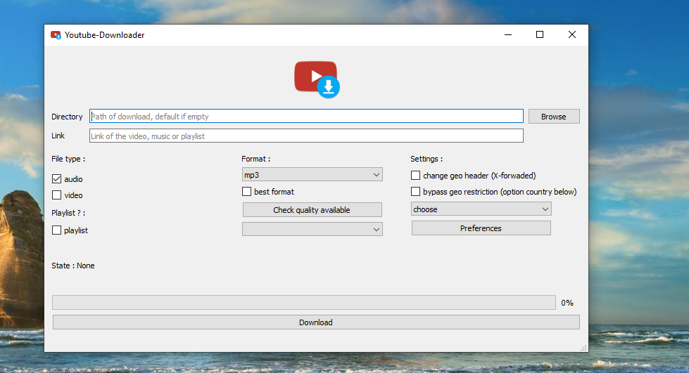

# youtube-downloader

[](https://shields.io/)
[](https://shields.io/)
[](https://shields.io/)
[](https://shields.io/)

## News
Youtube-dl is now working on our files for windows.
Windows is now integrated.
Video download is now integrated.
Future improvements : 
- correct bugs of the progress bar : Done
- correct bugs of first launch : Done
- intelligent download with geo parameters
- list of link to download
## Linux
### Installation
1. Clone the repo
2. Create a config.txt file like bellow :
```
# Configuration file

# Put there the absolute path to the folder where you want to put by default music and video downloaded (like the example bellow :
default_path_music=/home/arblade/Musics/myfolder
default_path_video=/home/arblade/Videos/myfolder
```
3. Launch `yt-downloader.py` with Python 3.6

## Windows
### Installation 

Here is the [Setup.exe](https://github.com/Arblade/youtube-downloader/releases/download/v3.0.1/Setup.exe)

## Use 

1. Choose your folder where to download your music / videos files
2. Paste your link.
3. Under gnome, a notification will pop up to inform you that the download is complete

**Important** : Sometimes, the conversion won't work : this is a bug, you have then to do it again, but this time launching the app with admin rights.


