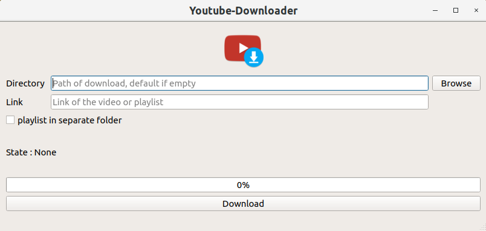

# youtube-downloader

## Installation
1. Clone the repo
2. Create a config.txt file like bellow :
```
# Configuration file

# Put there the absolute path to the folder (like the example bellow :
default_path=/home/arblade/Documents/myfolder
```
3. Launch `yt-downloader.py` with Python 3.6

## Use 

1. Choose your folder where to download your music / videos files
2. Paste your link.
3. Under gnome, a notification will pop up to inform you that the download is complete


